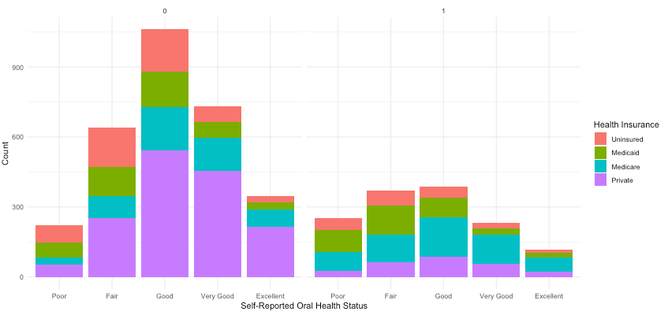

**Author:** Elizabeth Alpert

#### Project Links (for reference)

[GitHub Repo](https://github.com/ealpert/AlpertBST260Project)

[Shiny App Code](app.R)

[R Markdown of Final Project Submission](ealpert-bst260finalproject.Rmd)

[HTML of Final Project Submission](ealpert-bst260finalproject.html)

## Welcome and Project Objectives

This project is designed to facilitate visualization of National Health and Nutrition Examination Survey (NHANES) data from 2017-2018. Specifically, this project focuses on associations between different exposures and oral health-related outcomes. Exposures investigated include: gender, age, race/ethnicity, education, health insurance, and disability status. Outcomes were oral health utilization, self-reported oral health status, and examiner-assessed oral health status.

Project Objectives:
- Through data visualization, gain a better understanding of the distribution of oral health related outcomes.
- Investigate differences between outcomes based on different exposures.
- Establish a foundation to further explore discrepancies between outcomes of oral health utilization, subjective oral health status, and objective (clinician-assessed) oral health status.

### NHANES Background

Initiated in 1960, NHANES is a cross-sectional survey using a complex sampling design in order to be representative of the non-institutionalized United States population. Compared with other national surveys, NHANES collects information through in-person survey questionnaires, physical examination, and laboratory testing.

Survey Data Collection:
- Individual questionnaire: medical history, risk factors, physical functioning, dietary data
- Family questionnaire: demographics, income, insurance
- Computer-assisted personal interview (CAPI): health status, physical activity, reproductive health, alcohol/tobacco
- Audio computer-assisted self interview (CASI): alcohol, drugs, sexual behavior


Frequently Asked Questions:
- How many individuals participate? *Approximately 34,000 are interviewed and 21,000 examined.*
- What is the response rate? *85% for interviews and 78% for exams. These are relatively high!*
- How is the complex sampling design accounted for in the analysis? *Survey procedures need to be used in statistical analysis, so weights are applied to the data to provide unbiased national estimates.*
- What are the main limitations of this data? *Since the data is cross-sectional, causality can't be determined. Information may be subject to recall bias. Sample sizes for certain variables may be small.*


### Oral Health Context
Dental caries (cavities) and periodontal disease (gum disease), the two most common dental problems, are largely preventable. More than 1 in 4 US adults have untreated cavities, and almost half have gum disease.

Robust evidence shows how a lack of dental care can result in nutritional problems and chronic pain. Research focusing on the oral-overall health connection demonstrates associations between oral infections and cardiovascular disease, bacterial pneumonia, adverse pregnancy outcomes, and diabetes. Effects of dental disease also extend beyond direct health effects. Adults with cavities or missing teeth are often self-conscious about their appearance, which can decrease social participation and make it harder to find and hold a job.

In the United States, there are grim disparities in who can access dental services. Unsurprisingly, underserved populations are disproportionately affected, including low-income communities, non-white Americans, people with disabilities, and older adults. Cost is the most significant barrier preventing access to dental care.

# Data Visualization

```{r}
library(haven)
library(tidyverse)
library(ggplot2)
library(ggmosaic)
library(survey)
library(survey)
library(shiny)
library(dslabs)

# Reading in "Demographic Variables and Sample Weights" data (covariates)
demo <- read_xpt("https://wwwn.cdc.gov/Nchs/Nhanes/2017-2018/DEMO_J.XPT") %>%
    select(SEQN, RIDSTATR, RIAGENDR, RIDAGEYR, RIDRETH3, DMDEDUC2,
           WTINT2YR, WTMEC2YR, SDMVPSU, SDMVSTRA)

# Reading in health insurance data (covariate)
insure <- read_xpt("https://wwwn.cdc.gov/Nchs/Nhanes/2017-2018/HIQ_J.XPT") %>%
    select(SEQN, HIQ011, HIQ031A, HIQ031B, HIQ031D)

# Reading in self-reported health status (covariate)
health <- read_xpt("https://wwwn.cdc.gov/Nchs/Nhanes/2017-2018/HSQ_J.XPT") %>%
    select(SEQN, HSD010)

# Reading in disability data (covariate)
disab <- read_xpt("https://wwwn.cdc.gov/Nchs/Nhanes/2017-2018/DLQ_J.XPT") %>%
    select(SEQN, DLQ010, DLQ020, DLQ040, DLQ050, DLQ060, DLQ080)

# Reading in self-reported oral health status and utilization data (outcome)
ohques <- read_xpt("https://wwwn.cdc.gov/Nchs/Nhanes/2017-2018/OHQ_J.XPT") %>%
    select(SEQN, OHQ030, OHQ845)

# Reading in examiner-assessed oral health status data (outcome)
ohexam <- read_xpt("https://wwwn.cdc.gov/Nchs/Nhanes/2017-2018/OHXREF_J.XPT") %>%
    select(SEQN, OHAREC, OHDEXSTS)

# Merging NHANES data
nhanesoh <- left_join(demo, insure, by = "SEQN")
nhanesoh <- left_join (nhanesoh, health, by = "SEQN")
nhanesoh <- left_join (nhanesoh, disab, by = "SEQN")
nhanesoh <- left_join (nhanesoh, ohques, by = "SEQN")
nhanesoh <- left_join (nhanesoh, ohexam, by = "SEQN")

# Creating categorical variable for age
nhanesoh <- mutate(nhanesoh, RIDAGEYR, agecat =
            ifelse(RIDAGEYR %in% 0:19, "0-19",
            ifelse(RIDAGEYR %in% 20:29, "20-29",
            ifelse(RIDAGEYR %in% 30:39, "30-39",
            ifelse(RIDAGEYR %in% 40:49, "40-49",
            ifelse(RIDAGEYR %in% 50:59, "50-59",
            ifelse(RIDAGEYR %in% 60:69, "60-69",
            ifelse(RIDAGEYR %in% 70:79, "70-79",
            ifelse(RIDAGEYR %in% 80:89, "80-89",
            ifelse(RIDAGEYR %in% 90:99, "90-99", "unsure"
            ))))))))))

# Defining disability covariate as dichotomous (presence of a disability = 1, no disability = 0)
nhanesoh <- mutate(nhanesoh, disability = ifelse(DLQ010==1 | DLQ020==1 | DLQ040==1 | DLQ050==1 | DLQ060==1 | DLQ080==1, 1, 0))

# Creating categorical variable for insurance
nhanesoh <- mutate(nhanesoh,
                 healthins = case_when(
                     HIQ011==2 ~ 1, #uninsured
                     HIQ031D==17 ~ 2, #medicaid
                     HIQ031B==15 ~ 3, #medicare
                     HIQ031A==14 ~ 4, #privateins
                 ))

# Reordering oral health utilization
nhanesoh <- mutate(nhanesoh,
                   ohutil = case_when(
                       OHQ030==7 ~ 1, #Never have been
                       OHQ030==6 ~ 2, #More than 5 Yrs Ago
                       OHQ030==5 ~ 3, #3-5 Yrs Ago
                       OHQ030==4 ~ 4, #2-3 Yrs Ago
                       OHQ030==3 ~ 5, #1-2 Yrs Ago
                       OHQ030==2 ~ 6, #6 Mo - 1 Yr Ago
                       OHQ030==1 ~ 7, #6 months or less
                   ))

# Reordering self-reported oral health
nhanesoh <- mutate(nhanesoh,
                   srohstatus = case_when(
                       OHQ845==5 ~ 1, #Poor
                       OHQ845==4 ~ 2, #Fair
                       OHQ845==3 ~ 3, #Good
                       OHQ845==2 ~ 4, #Very good
                       OHQ845==1 ~ 5, #Excellent
                   ))

# Removing irrelevant data frames
remove(demo, disab, health, insure, ohexam, ohques)

# Filtering on individuals who were both interviewed and examined (RIDSTATR), filtering on individuals who received complete dental exam (OHDEXSTS) 
# From NHANES documentation, there are no missing values for gender, age, race/ethnicity
nhanesoh <- nhanesoh %>%
    filter(RIDSTATR==2) %>% #Dropped 550 observations (if not both interviewed adn examined)
    filter(OHDEXSTS==1) %>% #Dropped 267 observations with partial or not done oral health exams
    drop_na(disability) %>% #Dropped 2159 observations with missing information on disability
    #drop_na(education) %>% #Dropped 884 observations with missing information on education
    drop_na(HSD010) %>% #Dropped 267 observations with missing information on self-reported health status
    # At this point, no missing values for ohutil, srohstatus, exohstatus
    # Updating data frame with created exposure and outcome variables, covariates (renamed), and relevant survey weights
    select(SEQN, RIAGENDR, RIDAGEYR, RIDRETH3, DMDEDUC2,
           WTINT2YR, WTMEC2YR, SDMVPSU, SDMVSTRA, HSD010, disability, ohutil, OHAREC, healthins, agecat, srohstatus) %>%
    rename(
        seqn = SEQN,
        gender = RIAGENDR,
        age = RIDAGEYR,
        "race/ethnicity" = RIDRETH3,
        education = DMDEDUC2,
        srhealthstatus = HSD010,
        psu = SDMVPSU,
        strata = SDMVSTRA,
        interviewweight = WTINT2YR,
        examweight = WTMEC2YR,
        exohstatus = OHAREC
    )

nhanesoh$education <- as.factor(nhanesoh$education)
nhanesoh$srohstatus <- as.factor(nhanesoh$srohstatus)
nhanesoh$gender <- as.factor(nhanesoh$gender)
nhanesoh$srohstatus <- as.factor(nhanesoh$srohstatus)
nhanesoh$exohstatus <- as.factor(nhanesoh$exohstatus)
nhanesoh$disability <- as.factor(nhanesoh$disability)
nhanesoh$"race/ethnicity" <- as.factor(nhanesoh$"race/ethnicity")
nhanesoh$ohutil <- as.factor(nhanesoh$ohutil)
nhanesoh$healthins <- as.factor(nhanesoh$healthins)

nhanesoh <- nhanesoh %>%
    filter(education %in% 1:5) %>%
    filter(srhealthstatus %in% 1:5) %>%
    filter(ohutil %in% 1:7) %>%
    filter(srohstatus %in% 1:5) %>%
    filter(exohstatus %in% 1:4) %>%
    filter(healthins %in% 1:4)
```
## Oral Health Outcomes

```{r}
nhanesoh %>% 
                ggplot() +
                geom_bar(aes(x = ohutil, fill = "#0c4c8a"), show.legend = FALSE) +
                ggtitle("Oral Health Utilization") +
                xlab("When Did You Last Visit a Dentist?") +
                ylab("Count") +
                theme_minimal() +
                scale_x_discrete(labels=c("Never", "5+ Yrs Ago", "3-5 Yrs Ago", "2-3 Yrs Ago", "1-2 Yrs Ago", "6 Mo - 1 Yr Ago", "< 6 Mo Ago"))
                
nhanesoh %>% 
                ggplot() +
                geom_bar(aes(x = srohstatus, fill = "#0c4c8a"), show.legend = FALSE) +
                ggtitle("Self-Reported Oral Health Status") +
                xlab("Self-Reported Oral Health Status") +
                ylab("Count") +
                theme_minimal() +
                scale_x_discrete(labels=c("Poor", "Fair", "Good", "Very Good", "Excellent"))

nhanesoh %>% 
                ggplot() +
                geom_bar(aes(x = exohstatus, fill = "#0c4c8a"), show.legend = FALSE) +
                ggtitle("Examiner-Assessed Oral Health Status") +
                xlab("When Examiner Recommends Seeing a Dentist") +
                ylab("Count") +
                theme_minimal() +
                scale_x_discrete(labels=c("Immediately", "Within 2 Weeks", "At Earliest Convenience", "Continue Regular Care"))
```


## Disability and Oral Health Utilization

```{r}
nhanesoh %>% 
                ggplot() +
                geom_bar(aes(x = ohutil, fill = gender)) +
                xlab("When Did You Last Visit a Dentist?") +
                scale_x_discrete(labels=c("Never", "5+ Yrs Ago", "3-5 Yrs Ago", "2-3 Yrs Ago", "1-2 Yrs Ago", "6 Mo - 1 Yr Ago", "< 6 Mo Ago")) +
                ylab("Count") +
                scale_fill_hue(name = "Gender", labels = c("Male", "Female")) +
                theme_minimal() +
                facet_wrap(vars(disability))

nhanesoh %>% 
                ggplot() +
                geom_bar(aes(x = ohutil, fill = agecat)) +
                xlab("When Did You Last Visit a Dentist?") +
                scale_x_discrete(labels=c("Never", "5+ Yrs Ago", "3-5 Yrs Ago", "2-3 Yrs Ago", "1-2 Yrs Ago", "6 Mo - 1 Yr Ago", "< 6 Mo Ago")) +
                ylab("Count") +
                scale_fill_hue() +
                theme_minimal() +
                facet_wrap(vars(disability)) +
                labs(fill = "Age Category")

nhanesoh %>% 
                ggplot() +
                geom_bar(aes(x = ohutil, fill = `race/ethnicity`)) +
                xlab("When Did You Last Visit a Dentist?") +
                scale_x_discrete(labels=c("Never", "5+ Yrs Ago", "3-5 Yrs Ago", "2-3 Yrs Ago", "1-2 Yrs Ago", "6 Mo - 1 Yr Ago", "< 6 Mo Ago")) +
                ylab("Count") +
                scale_fill_hue(name = "Race/Ethnicity", labels = c("Mexican American", "Other Hispanic", "Non-Hispanic White", "Non-Hispanic Black", "Non-Hispanic Asian", "Other Race")) +
                theme_minimal() +
                facet_wrap(vars(disability))

nhanesoh %>% 
                ggplot() +
                geom_bar(aes(x = ohutil, fill = education)) +
                xlab("When Did You Last Visit a Dentist?") +
                scale_x_discrete(labels=c("Never", "5+ Yrs Ago", "3-5 Yrs Ago", "2-3 Yrs Ago", "1-2 Yrs Ago", "6 Mo - 1 Yr Ago", "< 6 Mo Ago")) +
                ylab("Count") +
                scale_fill_hue(name = "Education", labels = c("< 9th Grade", "9th-11th Grade", "High School/GED", "Some College/AA", "College +")) +
                theme_minimal() +
                facet_wrap(vars(disability))

nhanesoh %>% 
                ggplot() +
                geom_bar(aes(x = ohutil, fill = healthins)) +
                xlab("When Did You Last Visit a Dentist?") +
                scale_x_discrete(labels=c("Never", "5+ Yrs Ago", "3-5 Yrs Ago", "2-3 Yrs Ago", "1-2 Yrs Ago", "6 Mo - 1 Yr Ago", "< 6 Mo Ago")) +
                ylab("Count") +
                scale_fill_hue(name = "Health Insurance", labels = c("Uninsured", "Medicaid", "Medicare", "Private")) +
                theme_minimal() +
                facet_wrap(vars(disability))
```


## Disability and Self-Reported Oral Health Status

```{r}
nhanesoh %>% 
                ggplot() +
                geom_bar(aes(x = srohstatus, fill = gender)) +
                xlab("Self-Reported Oral Health Status") +
                scale_x_discrete(labels=c("Poor", "Fair", "Good", "Very Good", "Excellent")) +
                ylab("Count") +
                scale_fill_hue(name = "Gender", labels = c("Male", "Female")) +
                theme_minimal() +
                facet_wrap(vars(disability))

nhanesoh %>% 
                ggplot() +
                geom_bar(aes(x = srohstatus, fill = agecat)) +
                xlab("Self-Reported Oral Health Status") +
                scale_x_discrete(labels=c("Poor", "Fair", "Good", "Very Good", "Excellent")) +
                ylab("Count") +
                scale_fill_hue() +
                theme_minimal() +
                facet_wrap(vars(disability)) +
                labs(fill = "Age Category")

nhanesoh %>% 
                ggplot() +
                geom_bar(aes(x = srohstatus, fill = `race/ethnicity`)) +
                xlab("Self-Reported Oral Health Status") +
                scale_x_discrete(labels=c("Poor", "Fair", "Good", "Very Good", "Excellent")) +
                ylab("Count") +
                scale_fill_hue(name = "Race/Ethnicity", labels = c("Mexican American", "Other Hispanic", "Non-Hispanic White", "Non-Hispanic Black", "Non-Hispanic Asian", "Other Race")) +
                theme_minimal() +
                facet_wrap(vars(disability))

nhanesoh %>% 
                ggplot() +
                geom_bar(aes(x = srohstatus, fill = education)) +
                xlab("Self-Reported Oral Health Status") +
                scale_x_discrete(labels=c("Poor", "Fair", "Good", "Very Good", "Excellent")) +
                ylab("Count") +
                scale_fill_hue(name = "Education", labels = c("< 9th Grade", "9th-11th Grade", "High School/GED", "Some College/AA", "College +")) +
                theme_minimal() +
                facet_wrap(vars(disability))

nhanesoh %>% 
                ggplot() +
                geom_bar(aes(x = srohstatus, fill = healthins)) +
                xlab("Self-Reported Oral Health Status") +
                scale_x_discrete(labels=c("Poor", "Fair", "Good", "Very Good", "Excellent")) +
                ylab("Count") +
                scale_fill_hue(name = "Health Insurance", labels = c("Uninsured", "Medicaid", "Medicare", "Private")) +
                theme_minimal() +
                facet_wrap(vars(disability))
```




## Disability and Examiner-Assessed Oral Health Status

```{r}
nhanesoh %>% 
                ggplot() +
                geom_bar(aes(x = exohstatus, fill = gender)) +
                xlab("When Examiner Recommends Seeing a Dentist") +
                scale_x_discrete(labels=c("Immediately", "Within 2 Weeks", "At Earliest Convenience", "Continue Regular Care")) +
                ylab("Count") +
                scale_fill_hue(name = "Gender", labels = c("Male", "Female")) +
                theme_minimal() +
                facet_wrap(vars(disability))

nhanesoh %>% 
                ggplot() +
                geom_bar(aes(x = exohstatus, fill = agecat)) +
                xlab("When Examiner Recommends Seeing a Dentist") +
                scale_x_discrete(labels=c("Immediately", "Within 2 Weeks", "At Earliest Convenience", "Continue Regular Care")) +
                ylab("Count") +
                scale_fill_hue() +
                theme_minimal() +
                facet_wrap(vars(disability)) +
                labs(fill = "Age Category")

nhanesoh %>% 
                ggplot() +
                geom_bar(aes(x = exohstatus, fill = `race/ethnicity`)) +
                xlab("When Examiner Recommends Seeing a Dentist") +
                scale_x_discrete(labels=c("Immediately", "Within 2 Weeks", "At Earliest Convenience", "Continue Regular Care")) +
                ylab("Count") +
                scale_fill_hue(name = "Race/Ethnicity", labels = c("Mexican American", "Other Hispanic", "Non-Hispanic White", "Non-Hispanic Black", "Non-Hispanic Asian", "Other Race")) +
                theme_minimal() +
                facet_wrap(vars(disability))

nhanesoh %>% 
                ggplot() +
                geom_bar(aes(x = exohstatus, fill = education)) +
                xlab("When Examiner Recommends Seeing a Dentist") +
                scale_x_discrete(labels=c("Immediately", "Within 2 Weeks", "At Earliest Convenience", "Continue Regular Care")) +
                ylab("Count") +
                scale_fill_hue(name = "Education", labels = c("< 9th Grade", "9th-11th Grade", "High School/GED", "Some College/AA", "College +")) +
                theme_minimal() +
                facet_wrap(vars(disability))

nhanesoh %>% 
                ggplot() +
                geom_bar(aes(x = exohstatus, fill = healthins)) +
                xlab("When Examiner Recommends Seeing a Dentist") +
                scale_x_discrete(labels=c("Immediately", "Within 2 Weeks", "At Earliest Convenience", "Continue Regular Care")) +
                ylab("Count") +
                scale_fill_hue(name = "Health Insurance", labels = c("Uninsured", "Medicaid", "Medicare", "Private")) +
                theme_minimal() +
                facet_wrap(vars(disability))
```


## The Impact of Age

```{r}
ggplot(nhanesoh) +
            aes(x = age, fill = disability) +
            geom_histogram(bins = 30L) +
            xlab("Age") +
            ylab("Count") +
            ggtitle("Age Distribution of Study Population") +
            scale_fill_hue(name = "Disability Status", labels = c("No Disability", "Presence of Disability")) +
            theme_minimal()

nhanesoh %>% 
                ggplot() +
                geom_boxplot(aes(x = ohutil, y = age, fill = disability)) +
                scale_fill_hue(name = "Disability Status", labels = c("No Disability", "Presence of Disability")) +
                xlab("When Did You Last Visit a Dentist?") +
                scale_x_discrete(labels=c("Never", "5+ Yrs Ago", "3-5 Yrs Ago", "2-3 Yrs Ago", "1-2 Yrs Ago", "6 Mo - 1 Yr Ago", "< 6 Mo Ago")) +
                ylab("Age") +
                theme_minimal()

nhanesoh %>% 
                ggplot() +
                geom_boxplot(aes(x = srohstatus, y = age, fill = disability)) +
                scale_fill_hue(name = "Disability Status", labels = c("No Disability", "Presence of Disability")) +
                xlab("Self-Reported Oral Health Status") +
                scale_x_discrete(labels=c("Poor", "Fair", "Good", "Very Good", "Excellent")) +
                ylab("Age") +
                theme_minimal()

nhanesoh %>% 
                ggplot() +
                geom_boxplot(aes(x = exohstatus, y = age, fill = disability)) +
                scale_fill_hue(name = "Disability Status", labels = c("No Disability", "Presence of Disability")) +
                xlab("When Examiner Recommends Seeing a Dentist") +
                scale_x_discrete(labels=c("Immediately", "Within 2 Weeks", "At Earliest Convenience", "Continue Regular Care")) +
                ylab("Age") +
                theme_minimal()
```


